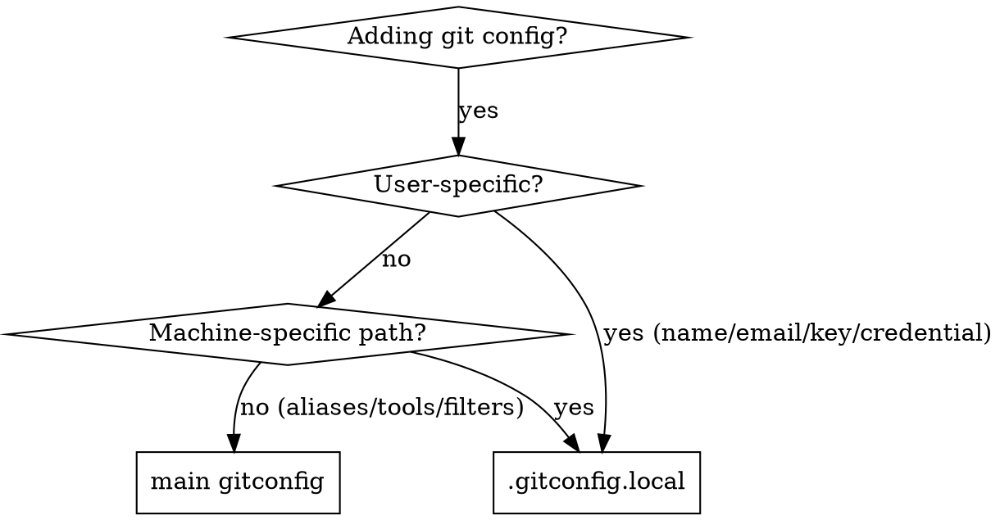

# Git Configuration Separation

## Overview
Separate personal git configuration from shareable settings using Git's `[include]` mechanism. Personal config stays local, shareable config goes in version control.

## When to Use



**Use when:**
- Adding/modifying git configuration
- Setting up git on new machines
- Reviewing git config changes
- See user info, credentials, or signing keys in config files

**Don't use when:**
- Modifying project-specific `.git/config` (those are per-repo)

## Quick Reference

| Setting Type | Location | Examples |
|--------------|----------|----------|
| User identity | `.gitconfig.local` | `user.name`, `user.email`, `user.signingkey` |
| Credentials | `.gitconfig.local` | `credential.*.helper` with paths |
| GPG signing | `.gitconfig.local` | `commit.gpgsign`, `gpg.format` |
| Aliases | Main `gitconfig` | `alias.co`, `alias.st` |
| Diff tools | Main `gitconfig` | `diff.tool`, `merge.tool` |
| Pager | Main `gitconfig` | `core.pager` (delta, diff-so-fancy) |
| Filters | Main `gitconfig` | `filter.lfs.*`, `filter.hawser.*` |
| Colors | Main `gitconfig` | `color.*`, `delta.*` |

## Configuration Strategy

**Two-tier git configuration:**

### Main Config (`~/.gitconfig` or project `.gitconfig`)
**Shareable configuration** - committed to repository
- Aliases
- Pager settings (delta, diff-so-fancy)
- Diff/merge tools
- Filters (LFS)
- Color schemes
- Core settings (editor, excludesfile)

### Local Config (`~/.gitconfig.local`)
**Personal configuration** - NOT committed
- `[user]` section (name, email, signingkey)
- `[gpg]` format settings
- `[commit]` gpgsign
- `[credential]` helpers with machine-specific paths

## Implementation

Main config must include:
```gitconfig
[include]
    path = ~/.gitconfig.local
```

## Rules When Modifying Configs

1. **Personal/machine-specific** → `.gitconfig.local`
2. **Generic/shareable** → `gitconfig`
3. **If uncertain** → put in `.gitconfig.local`

## Verification

After changes, verify configs load from correct location:
```bash
# Check where specific configs are loaded from
git config --list --show-origin | grep -E "(user\.name|gpgsign)"

# Verify .gitconfig.local is being included
git config --get --include include.path
```

**Expected output:** Personal configs should show `file:.../.gitconfig.local` origin

**Example:**
```
file:/Users/yourname/.gitconfig.local	user.name=Your Name
file:/Users/yourname/.gitconfig.local	commit.gpgsign=true
```

## Common Mistakes

| Mistake | Fix |
|---------|-----|
| Committing `.gitconfig.local` | Ensure it's excluded or outside repo |
| Hardcoding machine paths | Use `.gitconfig.local` for path-specific configs |
| Mixing personal/shared in one file | Separate using include mechanism |

## Example

**Before (mixed in one file):**
```gitconfig
[user]
    name = dragonkid        # Personal - shouldn't be committed
    email = idragonkid@gmail.com

[alias]
    co = checkout          # Shareable - OK to commit
    st = status

[credential "https://github.com"]
    helper = !/usr/local/bin/gh auth git-credential  # Machine-specific
```

**After (separated):**

**`~/.gitconfig`** (committed to dotfiles):
```gitconfig
[include]
    path = ~/.gitconfig.local

[alias]
    co = checkout
    st = status
```

**`~/.gitconfig.local`** (NOT committed):
```gitconfig
[user]
    name = dragonkid
    email = idragonkid@gmail.com

[credential "https://github.com"]
    helper = !/usr/local/bin/gh auth git-credential
```
