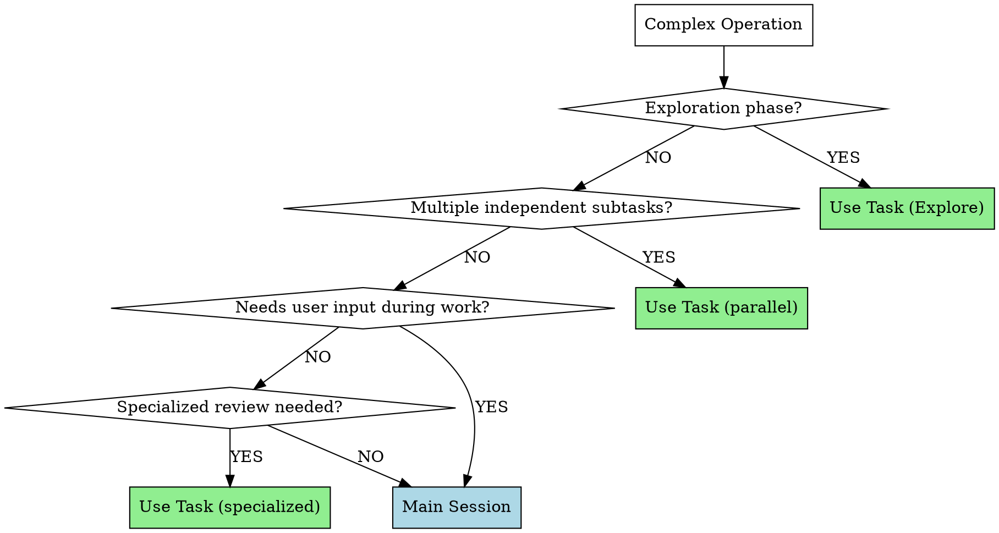

# Choosing Task vs Main Session

## Overview

**Task (subagent) is NOT for "complex tasks" - it's for specific task TYPES.** Wrong choice wastes time (overhead) or context (burning main session tokens on pure exploration).

## When to Use

Apply this decision pattern when:
- Encountering a complex operation (multi-file, uncertain scope, >50 lines)
- Considering whether to delegate work
- About to do extensive codebase exploration
- Facing multiple independent subtasks

## Quick Reference

| Scenario | Use | Why |
|----------|-----|-----|
| Codebase exploration (>20 files) | Task (Explore agent) | Saves main context, fresh 200k tokens |
| Multiple independent tasks | Task (parallel) | Time savings |
| Specialized review | Task (code-review, security) | Domain expertise |
| Needs user feedback mid-task | Main Session | Subagent can't ask questions |
| Depends on conversation history | Main Session | Context dependency |
| Sequential dependencies (A→B→C) | Main Session | No parallelism benefit |
| Tightly coupled changes | Main Session | Coordination complexity |
| Simple search (<20 files) | Main Session (Grep) | Overhead not worth it |

## Core Pattern



## Implementation

### Scenario 1: Pure Exploration (Use Task - Explore Agent ✅)

**Trigger**: Searching codebase (>20 files), finding patterns, understanding architecture

**Example**:
```
❌ Wrong: Use Grep in main session to search 500 files
   → Grep results burn main session context

✅ Correct: Dispatch Explore agent to search and summarize
   → Agent has fresh 200k tokens, returns only summary
```

**Why Task (Explore)**:
- Read-only operation
- Large result set would consume main context
- Benefits from specialized exploration logic
- Returns concise summary to main session

**Code**:
```
Task(
  description="Find auth pattern usage",
  subagent_type="Explore",
  prompt="Find all uses of oldAuthMethod in codebase, analyze usage patterns..."
)
```

**Threshold**: Use Explore agent when searching >20 files or expecting large result sets

### Scenario 2: Iterative Refinement (Main Session ✅)

**Trigger**: User needs to provide feedback, preferences unclear, design decisions needed

**Example**:
```
❌ Wrong: Dispatch Task to refactor auth system
✅ Correct: Work in main session, ask questions, present plan
```

**Why Main Session**:
- Subagent can't ask user questions
- Needs conversation context
- Requires plan approval (per CLAUDE.md)
- User preferences not yet known

### Scenario 3: Parallel Independent Work (Use Task ✅)

**Trigger**: Multiple unrelated tasks, no shared state, can run simultaneously

**Example**:
```
✅ Correct: Dispatch 3 Tasks in parallel
  - Task 1: Update documentation
  - Task 2: Run security scan
  - Task 3: Check test coverage
```

**Why Task**: Massive time savings (3x speedup)

### Scenario 4: Sequential Dependencies (Main Session ✅)

**Trigger**: Task B depends on Task A output

**Example**:
```
❌ Wrong: Task 1 → analyze, Task 2 → implement
✅ Correct: Do both in main session
```

**Why Main Session**: No parallelism benefit, overhead without gain

## Common Mistakes

**Mistake 1**: "This task is complex, so I'll use Task"
**Reality**: Complexity doesn't determine Task usage - task TYPE and interaction needs do
**Fix**: Use the decision flowchart, not complexity as sole factor

**Mistake 2**: Using main session Grep for large codebase exploration (>20 files)
**Reality**: Large result sets burn main context, Explore agent returns only summary
**Fix**: Dispatch Explore agent when searching many files

**Mistake 3**: Using Task for context-dependent work
**Reality**: Must serialize all conversation context in prompt, inefficient
**Fix**: If it needs conversation history or previous decisions, use main session

**Mistake 4**: Using Task for tightly coupled changes
**Reality**: Multiple files that must be coordinated together need shared context
**Fix**: Integrated changes → main session

## Real-World Impact

**Testing Results** (2026-02-07):

**Baseline (without skill)**:
- Subagent chose "Main Session + Grep" for 500-file search
- Reasoning: "Grep is faster, simple search"
- ❌ Missed: Should use Explore agent to save main context

**With skill**:
- Subagent correctly chose "Task (Explore agent)"
- Referenced: ">20 files threshold", Quick Reference table, Common Mistake #2
- ✅ Correct: Applied decision pattern accurately

**This session usage**:
- ✅ Used Explore agent for understanding claude/ structure
- ✅ Did optimization in main session with user feedback
- Demonstrates correct application of decision pattern
